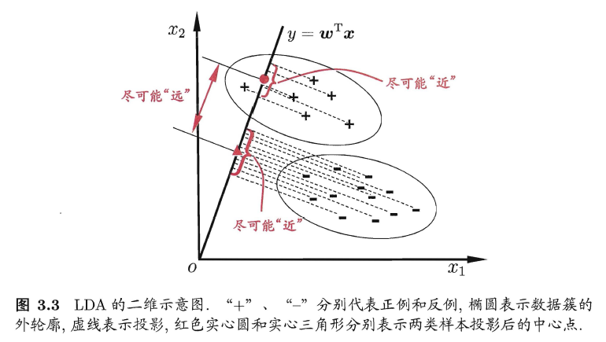
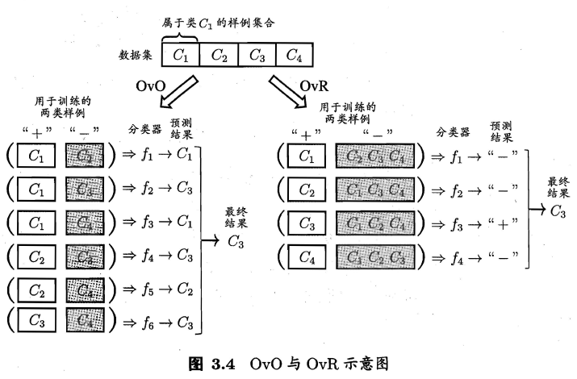
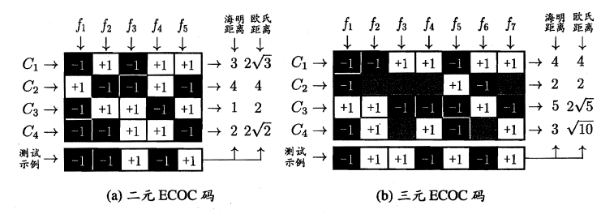

# 第三章 线性模型

### 3.1 基本形式

- 给定由$d$个属性描述的示例$x=(x_1,x_2,x_3,...,x_d)$，其中$x_i$是$x$的第$i$个属性上的取值，线性模型（linear model）试图学习得到一个通过属性的线性组合来预测的函数，即：$f(x)=w_1x_1+w_2x_2+w_3x_3+...+w_dx_d+b$。
- 一般用向量形式写成$f(x)=w^tx+b$，其中$w=(w_1,w_2,w_3,...,w_d)$

### 3.2 线性回归

- 给定数据集$D={(x_1,y_1),(x_2,y_2),(x_3,y_3),...,(x_m,y_m)}$，其中$x_i=(x_{i1};x_{i,2};...;x_{id})，y_i\in R$
- 线性回归（linear regression）试图学的一个线性模型以尽可能准确的预测实值输出标记。
  - 假设属性的数量只有1个。$D={(x_i,y_i)}_{i=1}^m，x_i \in R$
  - 对离散属性，如果属性值间存在序关系(order)，可通过连续化将其化为连续值；如果属性值间不存在序关系，通常转化为$k$维向量。
  - 线性回归试图学得$f(x_i)=wx_i+b$，使得$f(x_i)≈y_i$
  - 均方误差是衡量回归任务中最常用的性能度量，利用将均方误差最小化，求得$w,b$：
    - $(w^*,b^*)=\mathop{\arg \min}\limits_{(w,b)}\sum_{i=1}^m(f(x_i)-y_i)^2=\mathop{\arg\min}\limits_{(w,b)}\sum_{i=1}^m(y_i-wx_i-b)^2$
    - 均方误差的几何意义对应了欧几里得距离或欧氏距离（Euclidean Distance）
    - 基于均方误差最小化来进行模型求解的方法称为最小二乘法（least square method）。
    - 线性回归中，最小二乘法试图找到一条直线，使所有样本到直线的欧式距离之和最小。
  - 求解$w,b$，使$E_{(w,b)}=\mathop{\arg\min}\limits_{(w,b)}\sum_{i=1}^m(y_i-wx_i-b)^2$最小的过程，称为线性回归模型的最小二乘参数估计（parameter estimation），可以将$E_{(w,b)}$对$w,b$分别求导
    - $\frac{\partial E_{(w,b)}}{\partial w}=2(w\sum_{i=1}^mx_i^2-\sum_{i=1}^m(y_i-b)x_i)$
    - $\frac{\partial E_{(w,b)}}{\partial b}=2(mb-\sum_{i=1}^m(y_i-wx_i))$
    - 令两个偏导数等于0，得到$w,b$最优解的闭式（closed-form）解：$w=\frac{\sum_{i=1}^my_i(x_i-\bar x)}{\sum_{i=1}^mx_i^2-\frac1m(\sum_{i=1}^mx_i)^2}$；$b=\frac1m\sum_{i=1}^m(y_i-wx_i)$。
  - 多元线性回归（multivariate linear regression）：在更一般的情况下，给定数据集$D$，样本由$d$个属性描述，我们试图得到$f(x_i)=w^Tx_i+b$使得$f(x_i)≈y_i$。
    - 利用最小二乘法对$w,b$进行估计，将$w,b$吸收入向量形式$\hat{w}=(w;b)$，把数据集$D$表示为一个$m×(d+1)$大小的矩阵$X$。矩阵每行对应一个示例，前$d$个元素对应于示例的$d$个属性值，最后一个元素为1。$X=\begin{pmatrix}x_{11}&x_{12}&x_{13}&\cdots&x_{1d}&1\\x_{21}&x_{22}&x_{23}&\cdots&x_{2d}&1\\\vdots&\vdots&\vdots&\ddots&\vdots&\vdots\\x_{m1}&x_{m2}&x_{m3}&\cdots&x_{md}&1\\\end{pmatrix}=\begin{pmatrix}x_1^T&1\\x_2^T&1\\\vdots&\vdots\\x_m^T&1\\\end{pmatrix}$
    - 把标记写成向量的形式$y=(y_1;y_2;...;y_m)$，得到：$\hat{w^*}=\mathop{\arg\min}\limits_{\hat{w}}(y-X\hat{w})^T(y-X\hat{w})=\mathop{\arg\min}\limits_{\hat{w}}E_{\hat{w}}$
    - 对$\hat{w}$求导得到：$\frac{\partial E_{\hat{w}}}{\partial w}=2X^T(X\hat{w}-y)$，令偏导数等于0可以得到闭式解。
    - 现实任务中，$X$的列数经常多于行数，可能会解出多个$\hat{w}$，通过引入正则化（regularization）项，确定算法的偏好。
  - 假如令模型逼近$y$的衍生物，例如$lny=w^Tx+b$，就得到对数线性回归（log-linear regression）。
    - 形式上仍然是线性回归；
    - 实质上实在求取输入空间到输出空间的非线性函数映射。
  - 更一般的，考虑单调可微函数$g(·)$：$y=g^{-1}(w^Tx+b)$为“广义线性模型”（generalized linear regression），其中$g(·)$为联系函数（link function）

### 3.3 对数几率回归

- 分类问题：找到一个单调可微函数将分类任务的真是标记与线性回归模型的预测值联系起来。
- 二分类任务，输出标记$y\in \{0,1\}$，线性回归$z=w^Tx+b$是实值，需要将z转换为0/1值，最理想的方式是单位阶跃函数(unit-step function)：$y=\begin{cases}0,& \text{$z$<0;}\\0.5, &\text{$z$=0;}\\1,&\text{$z$>0,}\end{cases}$
- 但是单位阶跃函数不连续，不能作为$g^-(·)$，需要找到类似的替代函数。可以选用对数几率函数（logistic function）：$y=\frac{1}{1+e^{-z}}$。
  - 对数几率函数是一种Sigmoid函数，把z值转化为一个接近0或1的y值，并且在z=0附近变化很陡。
  - 得到$ln\frac{y}{1-y}=w^T+b$，将y视作x是正例的可能性，1-y为x可能是反例的可能性，则$\frac{y}{1-y}$为几率（odds），反映了x作为正例的相对可能性。
  - 对数几率模型实际是用线性回归模型的预测结果去逼近实际标记的对数几率。
  - 对数几率回归是一种分类学习方法，不仅能够预测出类别，还可以得到近似概率预测。
  - 对数几率函数时任意阶可导凸函数，具有很好的数学性质。
  - 将$y$视为类后验概率估计$p(y=1|x)$，可以得到：$ln\frac{p(y=1|x)}{p(y=0|x)}=w^Tx+b$
    - $p(y=1|x)=\frac{e^{w^Tx+b}}{1+e^{w^T+b}}$
    - $p(y=0|x)=\frac{1}{1+e^{w^Tx+b}}$
    - 可以通过极大似然估计（maximum likelihood method）来估计$w,b$，给定数据集$\{(x_i,y_i)\}_{i=1}^m$，对数几率模型最大化“对数似然”（log-likelihood）：$l(w,b)=\sum_{i=1}^mlnp(y_i|x_i;w,b)$，即令每个样本属于真实标记的概率越大越好。

### 3.4 线性判别分析

- 线性判别分析（Linear Discriminant Analysis，LDA）最早在二分类问题上提出，又称Fisher判别分析。

  - 给定训练样例集，设法将杨丽投影到一条直线上，使得同类样例的投影点尽可能接近、异类样例的投影点尽可能远离
  - 在对新样本进行分类时，将其投影到同样的直线上，根据投影点的位置确定新样本的类别。
  - 二维示意图：

  

  - 给定数据集$D=\{(x_i,y_i\}_{i=1}^m,y_i \in \{0,1\}$，令$X_i,\mu_i,\sum_i$分别表示第$i\in\{0,1\}$类示例的集合、均值向量、协方差矩阵。
  - 将数据投影到直线$\vec w$，两类样本的中心在直线上的投影分别为$w^T\mu_0$和$w^T\mu_1$。
  - 若将所有样本点都投影到直线上，两类样本的协方差分别为$w^T\sum_0w$和$w^T\sum_1w$。由于直线是一维空间，所以$w^T\mu_0,w^T\mu_1,w^T\sum_0w,w^T\sum_1w$为实数。
    - 欲使同类样例投影点尽可能接近，可以让同类样例投影点的协方差尽可能小，即$w^T\sum_0w+w^T\sum_1w$尽可能小。
    - 欲使异类样例投影点尽可能远离，可以让类中心之间的距离尽可能大，即$||w^T\mu_0-w^T\mu_1||_2^2$尽可能大。
    - 同时考虑二者，得到最大化目标：$J=\frac{||w^T\mu_0-w^T\mu_1||_2^2}{w^T\sum_0w+w^T\sum_1w}=\frac{w^T(\mu_0-\mu_1)(\mu_0-\mu_1)^Tw}{w^T(\sum_0+\sum_1)w}$
    - 定义“类内散度矩阵”（within-class scatter matrix）：$S_w=\sum_0+\sum_1=\mathop{\sum}\limits_{x \in X_0}(x-\mu_0)(x-\mu_0)^T+\mathop{\sum}\limits_{x \in X_1}(x-\mu_1)(x-\mu_1)^T$；以及“类间散度矩阵”（between-class scatter matrix）：$S_b=(\mu_0-\mu_1)(\mu_0-\mu_1)^T$
    - 最大化目标可以重写为$J=\frac{w^TS_bw}{w^TS_ww}$，为LDA的最大化目标。即$S_b,S_w$的广义瑞丽商（generalized Rayleigh quotient）
    - $J$的分子和分母都是关于$w$的二次项，因此解与$w$的长度无关，只与其方向有关。
  - LDA可以从贝叶斯决策理论的角度阐释：当两类数据同先验，满足高斯分布且协方差相等时，LDA可达到最优分类。

### 3.5 多分类学习

- 多数情况下，利用二分类学习解决多分类问题。

- $N$个类别$C_1,C_2,...,C_N$，多分类学习的基本思路是“拆解法”，将多分类任务拆解为若干个二分类任务求解。

  - 先对问题进行拆分，然后为拆分出的每个二分类任务求解。
  - 在测试时，对这些分类器的预测结果进行集成已获得最终的多分类结果

- 最经典的拆分策略有三种：“一对一”（One vs. One，简称OVO），“一对其余”（One vs. Rest，简称OvR），“多对多”（Many vs. Many，简称MvM）。

  

- ECOC将编码的思想引入类别拆分，并尽可能在解码过程中具有容错性。

  - 编码：对$N$个类别做$M$次划分，每次划分将一部分类别化为正类，一部分化为反类，从而形成一个二分类训练集；一共产生$M$个训练集，训练出$M$个分类器。
  - 解码：$M$个分类器分别对测试样本进行预测，这些预测标记组成一个编码。将这个预测编码与每个类别各自的编码进行比较，返回其中距离最小的类别作为最终预测结果。
  - 类别划分通过“编码矩阵”（coding matrix）指定。
    - 二元码：将每个类别分别指定为正类和反类。
    - 三元码：在正、反类之外，还有“停用类”。

  

  - 对同一个学习任务，ECOC编码越长，纠错能力越强。然而编码越长意味着所需训练的分类器越多，计算存储开销越大。
  - 对同等长度的编码，理论上来说，任意两个类别之间的距离越远，纠错能力越强。因此，在码长较小时可根据这个原则计算出理论最优编码。

### 3.6 类别不平衡问题

- 类别不平衡（class-imbalance）就是指分类任务中不同类别的训练杨丽树木差别很大的情况。
- 假定正类样例较少$(m^+$个)，反类样例较多（$m^-$个）的情况。
  - 观测几率为$\frac{m^+}{m^-}$，当分类器的预测几率高于观测几率时，就可以判为正例：$\frac{y}{1-y}>\frac{m^+}{m^-}$
- 分类不平衡学习的基本策略：再缩放（rescaling）
  - 训练集是真是样本总体的无偏采样这个假设往往并不成立。
