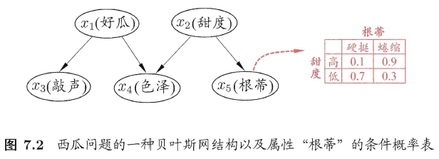
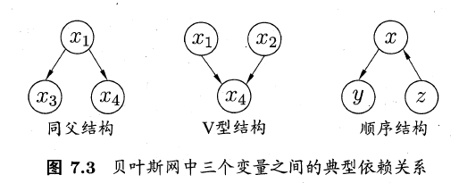

# 第七章 贝叶斯分类器

### 7.1 贝叶斯决策论

- 贝叶斯决策论（Bayesian Decision Theory）是概率框架下实施决策的基本方法。
  - 在所有相关概率都已知的理想情形下
  - 考虑如何基于已知概率和误判损失来选择最优的类别标记。

- 假设有$N$中可能的类别标记，即$Y=\{c_1,c_2,...,c_N\}$，$\lambda_{ij}$是将一个真实标记为$c_j$的样本误分类为$c_i$所产生的损失，基于后验概率$P(c_i|x)$可获得将样本$x$分类为$c_i$所产生期望损失（expected loss），即在样本$x$上的条件风险（conditional risk）：$R(c_i|x)=\sum_{j=1}^N\lambda_{ij}P(c_j|x)$
  - 寻找一个判定准则：$h:X\rarr Y$以**最小化总体风险**$R(h)=E_x[R(h(x)|x)]$
  - 对每个样本$x$，若$h$能最小化条件风险$R(h(x)|x)$，则总体风险$R(h)$也将被最小化。
  - 贝叶斯判定准则（Bayes decision rule）：为最小化总体风险，只需在每个样本上选择那个**能使条件风险$R(c|x)$最小**的类别标记。即$h^*(x)=\mathop{arg\text{ min}}\limits_{c\in Y}R(c|x)$
  - $h^*$称为贝叶斯最优分类器（Bayes optimal classifier），与之对应的总体风险$R(h^*)$称为贝叶斯风险（Bayes risk）。$1-R(h^*)$反映了分类器所能达到的最好性能，即通过机器学习所能产生的模型精度的理论上限。
    - 若目标是最小化分类错误率，则误判损失$\lambda_{ij}$可写为$\lambda_{ij}=\begin{cases}0,&\text{if i=j;}\\1,&\text{otherwise}\end{cases}$
    - 此时风险条件$R(c|x)=1-P(c|x)$
    - 最小化分类错误率的贝叶斯最优分类器为$h^*(x)=\mathop{arg\text{ max}}\limits_{c\in Y}P(c|x)$，即对每个样本$x$，选择能使后验概率$P(c|x)$最大的类别标记。

- 使用贝叶斯判定准则来最小化决策风险，首先要获得后验概率$P(c|x)$。然而，现实任务中通常难以直接获得。机器学习要实现的是基于有限的训练样本集尽可能的准确估计后验概率$P(c|x)$。有两种策略：
  - 给定$x$，通过直接建模$P(c|x)$来预测$c$，这样得到的是“判别式模式”（discriminative models）：决策树、BP神经网络、支持向量机
  - 先对联合概率分布$P(x,c)$建模，然后由此获得$P(c|x)$，这样得到的是“生成式模型”（generative models）。
    - $P(c|x)=\frac{P(x,c)}{P(x)}$
    - 基于贝叶斯定理，$P(c|x)$可以写为$P(c|x)=\frac{P(c)P(x|c)}{P(x)}$，其中$P(c)$是类“先验”（prior）概率；$P(x|c)$是样本$x$相对于类标记$c$的类条件概率（class-conditional probability），或称为似然（likelihood）；$P(x)$是用于归一化的“证据”（evidence）因子。
    - 给定样本$x$，证据因子$P(x)$与类标记无关，因此估计$P(c|x)$的问题转化为如何给予训练数据$D$来估计先验$P(c)$和似然$P(c|x)$。
      - 类先验概率$P(c)$表达了样本空间中各类样本所占的比例，根据大数定律，当训练集包含充足的独立同分布样本时，$P(c)$可以通过各类样本出现的频率来进行估计
      - 对类条件概率$P(c|x)$来说，它涉及关于$x$所有属性的联合概率，直接根据样本出现的频率来估计会遇到严重困难。

### 7.2 极大似然估计

- 估计类条件概率的一种常用策略是先假定其具有某种确定的概率分布形式，再基于训练样本对概率分布的参数进行估计。
  - 记关于类别$c$的类条件概率为$P(x|c)$，假设$P(x|c)$具有确定的形式并且被参数向量$\theta_c$唯一确定，则我们的任务就是利用训练集$D$估计参数$\theta_c$。
  - $P(x|c)$可以被记为$P(x|\theta_c)$。
- 概率模型的训练过程就是参数估计（parameter estimation）过程，对于参数估计，统计学两个学派提供了不同的解决方案：
  - 频率主义学派（Frequentist）：认为参数虽然未知，但却是客观存在的固定值。
  - 贝叶斯学派（Bayesian）：认为参数是未观察到的随机变量，其本身也可有分布。可以假定参数服从一个先验分布，然后基于观测到的数据来计算参数的后验分布。
- 极大似然估计（Maximum Likelihood Estimation，简称MLE）源自于频率主义学派，根据数据采样来估计概率分布参数。
  - 令$D_c$表示训练集$D$中第$c$类样本组成的集合，假设这些样本是独立同分布的，则参数$\theta_c$对于数据集$D_c$的似然是$P(D_c|\theta_c)=\prod_{x\in {D_c}}P(x|\theta_c)$
  - 对$\theta_c$进行极大似然估计，就是寻找能最大化似然$P(D_c|\theta_c)$的参数值$\hat\theta_c$。直观上看，极大似然估计是试图在$\theta_c$所有可能的取值中，找到一个能使数据出现的“可能性”最大的值。
  - 连乘操作易造成下溢，通常使用对数似然（log-likelihood）$LL(\theta_c)=logP(D_c|\theta_c)=\sum_{x\in {D_c}}logP(x|\theta_c)$
    - 此时参数$\theta_c$的极大似然估计$\hat\theta_c$为$\hat\theta_c=\mathop{\text{arg max}}\limits_{\theta_c}LL(\theta_c)$
  - 这种参数化的方法能使类条件概率估计变得相对简单
  - 估计结果的准确性严重依赖所假设的概率分部形式是否符合潜在的真实数据分布。

### 7.3 朴素贝叶斯分类器

- 基于贝叶斯公式来估计后验概率$P(c|x)$的主要困难再与：类条件概率$P(x|c)$ 是所有属性上的联合概率。难以从有限的训练样本直接估计得到。
- 朴素贝叶斯分类器（naive Bayes classifier）采用了“属性条件独立性假设”（attribute conditional independence assumption）：对已知类别，假设所有属性相互独立。
- 基于属性条件独立性假设，可以得到$P(c|x)=\frac{P(c)P(x|c)}{P(x)}=\frac{P(c)}{P(x)}\prod_{i=1}^dP(x_i|c)$
  - 其中$d$为属性数目
  - $x_i$为$x$在第$i$个属性上的取值。
- 基于上式得到贝叶斯判定准则$h_{nb}(x)=\mathop{\text{arg max}}\limits_{c\in Y}P(c)\prod_{i=1}^dP(x_i|c)$，此为朴素贝叶斯分类器的表达式。
- 朴素贝叶斯分类器的训练过程就是基于训练集$D$来估计类先验概率$P(c)$，并为每个属性估计条件概率$P(x_i|c)$。
  - 令$D_c$表示训练集$D$中第$c$类样本组成的集合，若有充足的独立同分布样本，则可容易地估计出类先验概率$P(c)=\frac{|D_c|}{|D|}$
  - 对离散属性而言，令$D_{c,x_i}$表示$D_c$中第$i$个属性上取值为$x_i$的样本组成的集合，则条件概率$P(x_i|c)$可估计为$P(x_i|c)=\frac{|D_{c,x_i}|}{D_c}$
  - 对连续属性可考虑概率密度函数，假定$p(x_i|c)~N(\mu_{c,i},\sigma _{c,i}^2)$，其中$\mu_{c,i}$和$\sigma^2_{c,i}$分别是第$c$类样本在第$i$个属性上取值的均值和方差，则有：$p(x_i|c)=\frac1{\sqrt{2\pi}\sigma_{c,i}}exp(-\frac{(x_i-\mu_{c,i})^2}{2\sigma_{c,i}^2})$
  - 为避免其他属性携带的信息被训练集中未出现的属性“抹去”，在估计概率值时通常要进行“平滑”，常用“拉普拉斯修正”（Laplacian correction）

### 7.4 半朴素贝叶斯分类器

- 为了降低贝叶斯公式中估计后验概率$P(c|x)$的困难，朴素贝叶斯分类器采用了属性条件独立性假设，但在现实任务中这个假设往往很难成立。

- 对属性条件独立性假设进行一定程度的放松，产生“半朴素贝叶斯分类器”（semi-naive Bayes classifier）

  - 基本想法：适当考虑一部分属性间的相互依赖信息，从而既不需完全进行联合概率计算，又不至于彻底忽略了比较强的属性依赖关系。
  - “独依赖估计”（One-Dependent Estimator 简称ODE）是半朴素贝叶斯分类器最常见的一种策略。“独依赖”就是假设每个属性在类别之外最多仅依赖于一个其他属性，即$P(c|x)\propto P(c)\prod_{i=1}^d P(x_i|c,pa_i)$
    - 其中$pa_i$为属性$x_i$所依赖的属性，称为$x_i$的父属性。
    - 对每个属性$x_i$，若其父属性$pa_i$已知，则可以估计概率值$P(x_i|c.pa_i)$
    - 问题的关键在于如何确定每个属性的父属性。

- 最直接的做法是假设所有属性都依赖于同一个属性，称为“超父”（super-parent），然后通过交叉验证等模型选择方法来确定超父属性，SPODE（Super-Parent ODE）方法。

  

- TAN（Tree Augmented naive Bayes）是在最大带权生成树算法的基础上，将属性间依赖关系约简为树形结构。

  

- AODE（Averaged One-Dependent Estimator）是一种基于机器学习机制、更为强大的独依赖分类器。AODE尝试将每个属性作为超父来构建SPODE，然后将那些具有足够训练数据支撑的SPODE集合起来作为最终结果。

### 7.5 贝叶斯网

- 贝叶斯网亦称“信念网”（belief network），它借助有向无环图（Directed Acyclic Graph，简称DAG）来刻画属性之间的依赖关系，并使用条件概率表（Conditional Probability Table，简称CPT）来描述属性的联合概率分布。

- 一个贝叶斯网$B$由结构$G$和参数$\Theta$两部分构成，即$B=\langle G,\Theta\rangle$

  - 网络结构$G$是一个有向无环图，每个结点对应于一个属性，若两个属性有直接依赖关系，则他们由一条边连接起来；
  - 参数$\Theta$定量描述这种依赖关系，假设属性$x_i$在$G$中的父结点集为$\pi_i$，则$\Theta$包含了每个属性的条件概率表$\theta_{x_i|\pi_i}=P_B(x_i|\pi_i)$

  

- “色泽”直接依赖于“好瓜”和“甜度”；“根蒂”直接依赖于“甜度”

#### 7.5.1 结构

- 贝叶斯结构网有效的表达了属性间的条件独立性。
- 给定父结点集，贝叶斯网假设每个属性与它的非后裔属性独立，于是$B=\langle G,\Theta\rangle$将属性$x_1,x_2,x_3,...,x_d$的联合概率分部定义为：$P_B(x_1,x_2,x_3,...,x_d)=\prod_{i=1}^dP_B(x_i|\pi_i)=\prod_{i=1}^d\theta_{x_i|\pi_i}$
- 贝叶斯网中三个变量之间的典型依赖关系：
  - 同父（common parent）结构中，给定父结点$x_i$的取值，则$x_3$和$x_4$条件独立。
  - 顺序结构中，给定$x$的取值，则$y$与$z$条件独立。
  - V型结构亦称冲撞结构，给定子节点$x_4$的取值，$x_1$和$x_2$**必不独立**。若$x_4$的取值完全未知，则$x_1$和$x_2$是相互独立的。（边际独立性marginal independence）

- 一个变量取值的确定与否，能对另两个变量的独立性发生影响。
- 分析有向图中变量间的条件独立性，可使用“有向分离”（D-separation）
  - 先把一个有向图转变为一个无向图：找出有向图中所有的V型结构，在V型结构的两个父结点之间加上一条无向边；将所有有向边改为无向边。
  - 由此产生的无向图成为“道德图”（moral graph），令父结点相连的过程称为“道德化”
  - 基于道德图能直观、迅速地找到变量间的条件独立性。假定道德图中有变量$x,y$和变量集合$z=\{z_i\}$，若变量$x$和$y$能在图上被$z$分开，即从道德图中将变量集合$z$去除后，$x$和$y$分属两个连通分支，则称变量$x$和$y$被$z$有向分离，$x\bot y|z$成立。

#### 7.5.2 学习

- 若网络结构已知，即属性间的依赖关系已知，则贝叶斯网的学习过程相对简单，只需通过对训练样本“计数”，估计出每个结点的条件概率即可。
- 现实应用中，往往不知道网络结构。贝叶斯网学习的首要任务就是根据训练数据集来找出结构最恰当的贝叶斯网。
- 常用方法“评分搜索”：
  - 评分函数引入了我们的归纳偏好
  - 评分函数通常基于信息论准则，将学习问题看做一个数据压缩任务，学习的目的是找到一个能以最短编码长度描述训练数据的模型。
  - 最小描述长度准则（Minimal Description Length）：选择综合编码长度（包括描述网络和编码数据）最短的贝叶斯网。

#### 7.5.3 推断

- 贝叶斯网训练好之后能用来回答“查询”（query），即通过一些属性变量的观测值来推测其他属性变量的取值。
- 通过已知变量观测值来推测待查询变量的过程称为“推断”（inferernce），已知变量观测值称为“证据”（evidence）